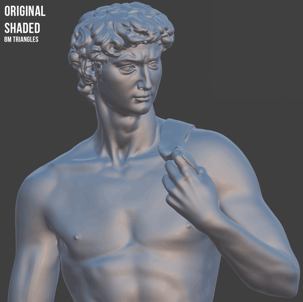

# Examples

## 3D Scan Decimation

Normal-preserving decimation on a high-density photogrammetry scan. The original mesh
has 2,450,000 polygons — crushed down to 12,500 while keeping the shading intact.

