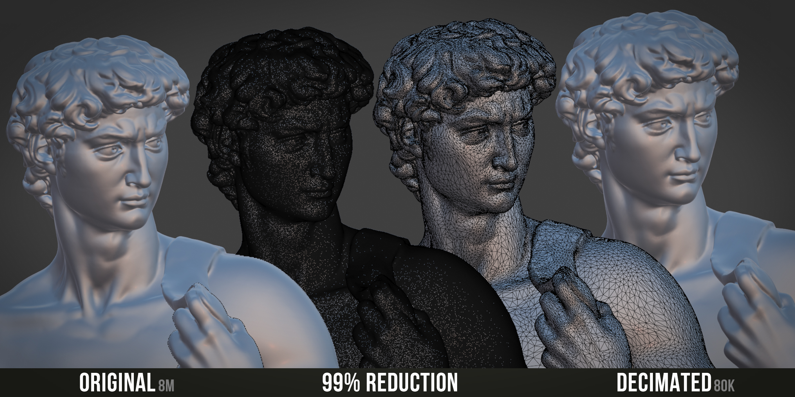

# Examples

## 3D Scan Decimation

Normal-preserving decimation on a high-density photogrammetry scan. The original mesh
has 2,450,000 polygons — crushed down to 12,500 while keeping the shading intact.

---

## 99% Reduction — 8M to 80K

Original 8 million polygon scan reduced by 99% to 80,000 polygons. Shading remains
visually identical to the original.

