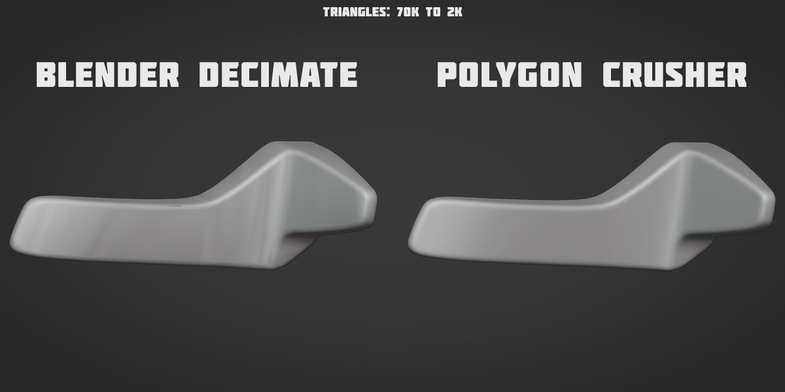
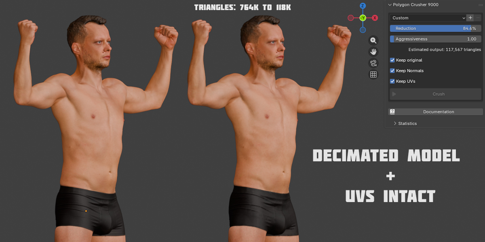
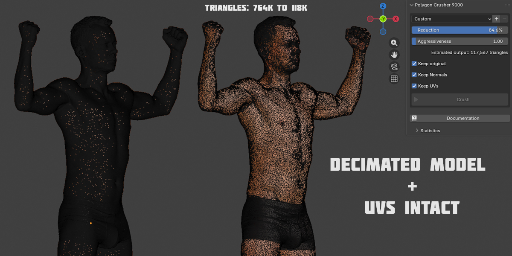

# Examples

## High-poly sculpt — 8M → 450K triangles

A photogrammetry-grade scan crushed to about 6% of its original triangle count.
Polygon Crusher runs roughly 11× faster than Blender's built-in Decimate and
avoids the artifacts and lost detail visible in the Decimate result.

---

## Hard-surface mesh — 70K → 2K triangles

A 97% reduction on a hard-surface mesh. Polygon Crusher preserves the silhouette
and curvature of the original shape on a tight triangle budget, where Decimate
distorts the form.

---

## Textured photogrammetry scan — 764K → 118K triangles, UVs preserved

A full-body 3D scan crushed by ~85% with **Keep UVs** enabled. The decimated
mesh keeps the original UV map intact, so the photographic texture stays
correctly mapped onto the lower-poly result — no re-baking, no seam distortion.

The wireframe view of the same crush makes the topology change explicit —
dense original on the left, ~85% lighter decimated result on the right:

