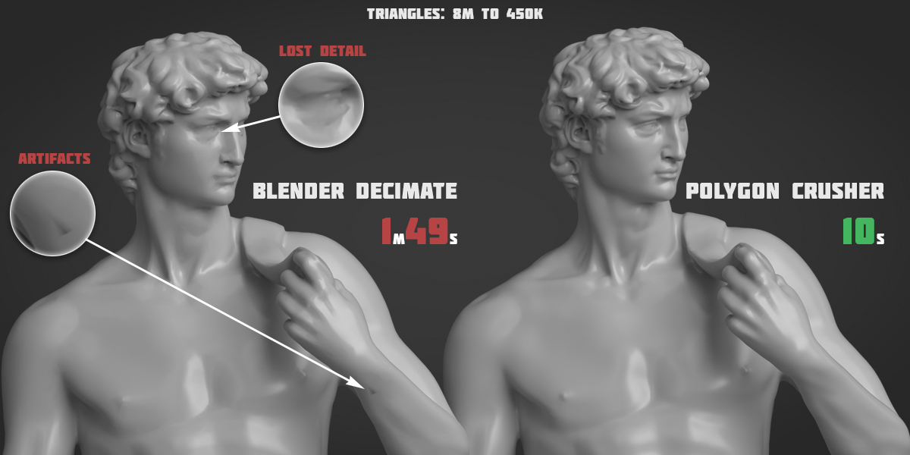

# Examples

## Polygon Crusher vs Blender Decimate

Same source mesh, same target reduction (8M → 450K triangles). Polygon Crusher
runs roughly 11× faster and avoids the artifacts and lost detail produced by
Blender's built-in Decimate modifier.

