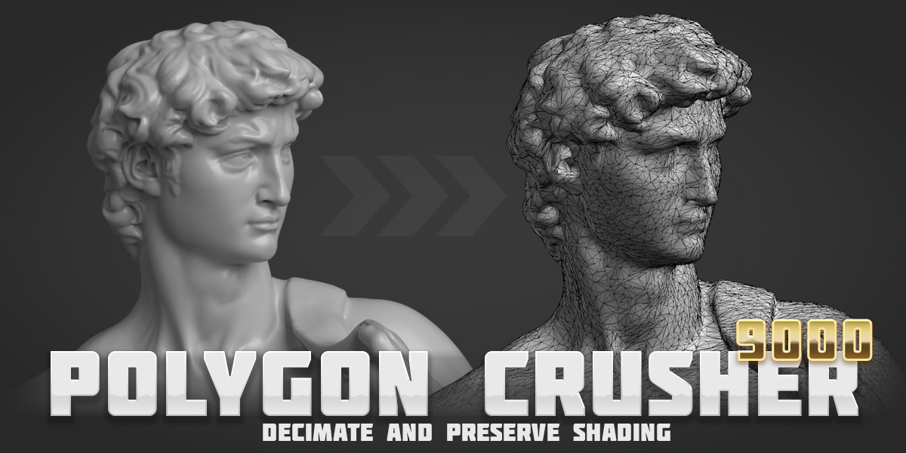

## What is Polygon Crusher 9000?

Polygon Crusher 9000 is a Blender addon for fast, high-quality mesh decimation.
It crushes multi-million-triangle meshes down to whatever budget your scene
needs while preserving the qualities that matter — surface shading, silhouette,
and UV mapping.

Unlike Blender's built-in Decimate, the simplifier runs as a worker subprocess,
so the UI stays responsive and large meshes finish in seconds. It's
modifier-aware, parallelizes across CPU cores for multi-object selections, and
includes a **Keep UVs** option that keeps the original UV map intact — handy
for textured photogrammetry scans where re-baking would otherwise be required.

Built for: 3D scans, sculpts, remeshed highpoly models, LOD generation.

[Get Started](getting-started/installation.md) · [Settings Reference](settings.md)

---

## Features

- **Smart Decimation** — high-quality mesh reduction that preserves shape and silhouette at any reduction level.
- **Normal Preservation** — transfers original surface normals onto the result, so smooth shading survives even aggressive crushing.
- **Modifier-Aware** — crushes the *evaluated* mesh; boolean, subdivision, and the rest of the modifier stack are baked in automatically. Originals stay untouched.
- **Tunable Aggressiveness** — dial how hard the simplifier pushes. Lower values keep fine features (eyes, hair, creases); higher values converge faster on lower-detail meshes.
- **Live Progress** — Blender stays responsive during long crushes — heavy work runs on a worker thread. Press **ESC** at any time to abort.
- **Session Stats** — per-object triangle counts and timing displayed after each crush, directly in the panel.

---

## Requirements

| | |
|---|---|
| **Blender** | 4.2 or later (tested on 5.1) |
| **OS** | Windows, macOS, Linux |

---

## Support

Questions or issues? Email [henriquevlopes@gmail.com](mailto:henriquevlopes@gmail.com)
